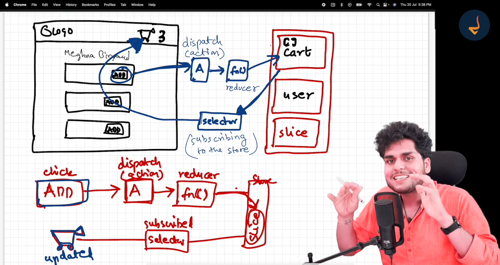

# 🚀 Namaste React: Episode 12 - Let's Build Our Store

## 📚 Redux

### Important Notes

> 1. Redux works on the data layer of application.
> 2. Redux is not mandatory.
> 3. Redux and React are different libraries.
> 4. Redux offers easy debugging.

> **Note:** Zustand is also a state management library like Redux.

> Redux Store is like a big JavaScript Object with a lot of data inside it & it is kept at a global data store.

---

## 🛒 Cart Feature + Redux Toolkit

### Implementation Steps

First, understand the working of Redux Toolkit with this diagram:



1. Install Redux Toolkit and React-Redux
2. Build our store
3. Connect our store to our app
4. Create a cart slice
5. Dispatch (Action)
6. Selector

---

## 📦 Installation

```bash
npm i @reduxjs/toolkit react-redux
```

### package.json

```json
{
  "name": "namaste-react",
  "version": "1.0.0",
  "description": "This is Namaste React course taught by Akshay Saini",
  "scripts": {
    "start": "parcel index.html",
    "build": "parcel build index.html",
    "test": "jest"
  },
  "keywords": ["JavaScript", "React", "JS"],
  "author": "Rahul",
  "license": "ISC",
  "dependencies": {
    "@reduxjs/toolkit": "^2.11.2",
    "@tailwindcss/postcss": "^4.1.18",
    "axios": "^1.13.2",
    "react": "^19.2.3",
    "react-dom": "^19.2.3",
    "react-redux": "^9.2.0",
    "react-router-dom": "^7.11.0",
    "tailwindcss": "^4.1.18"
  },
  "browserslist": ["last 2 versions"],
  "devDependencies": {
    "buffer": "^6.0.3",
    "parcel": "^2.16.3"
  }
}
```

---

## 🏪 Creating Store

### appStore.js

```js
const { configureStore } = require("@reduxjs/toolkit");

const appStore = configureStore({});

export default appStore;
```

---

## 🔌 Connecting Store to App

> Provider coming from react-redux will provide the store to our application.

```js
<Provider store={appStore}>
  <UserContext.Provider value={{ loggedInUser: userName, setUserName }}>
    <div className="app">
      <Header />
      <Outlet />
    </div>
  </UserContext.Provider>
</Provider>
```

### App.js

```js
import React, { useEffect, useState } from "react";
import ReactDOM from "react-dom/client";
import Header from "./components/Header";
import Body from "./components/Body";
import { createBrowserRouter, RouterProvider, Outlet } from "react-router";
import About from "./components/About";
import Contact from "./components/Contact";
import Error from "./components/Error";
import RestaurantMenu from "./components/RestaurantMenu";
// import Grocery from "./components/Grocery"; // This will not load with lazyLoading
import { lazy, Suspense } from "react";
import UserContext from "./utils/UserContext";
import { Provider } from "react-redux";
import appStore from "./utils/appStore";

/*Lazy Loading*/
const Grocery = lazy(() => import("./components/Grocery"));

const AppLayout = () => {
  const [userName, setUserName] = useState();

  useEffect(() => {
    /*Authentication API*/
    const data = {
      name: "Rahul",
    };
    setUserName(data.name);
  }, []);

  return (
    <Provider store={appStore}>
      <UserContext.Provider value={{ loggedInUser: userName, setUserName }}>
        <div className="app">
          <Header />
          <Outlet />
        </div>
      </UserContext.Provider>
    </Provider>
  );
};

const appRouter = createBrowserRouter([
  {
    path: "/",
    element: <AppLayout />,
    children: [
      {
        path: "/",
        element: <Body />,
      },
      {
        path: "/about",
        element: <About />,
      },
      {
        path: "/contact",
        element: <Contact />,
      },
      {
        path: "/grocery",
        element: (
          <Suspense fallback={<h1>Loading...</h1>}>
            <Grocery />
          </Suspense>
        ),
      },
      {
        path: "/restaurant/:resId",
        element: <RestaurantMenu />,
      },
    ],
    errorElement: <Error />,
  },
]);

const root = ReactDOM.createRoot(document.getElementById("root"));
root.render(<RouterProvider router={appRouter} />);
```

---

## 🔪 Creating a Slice

### cartSlice.js

```js
import { createSlice } from "@reduxjs/toolkit";

const cartSlice = createSlice({
  name: "cart",
  initialState: {
    items: [],
  },
  reducers: {
    addItem: (state, action) => {
      state.items.push(action.payload);
    },
    removeItem: (state) => {
      state.items.pop();
    },
    clearCart: (state) => {
      state.items.length = 0;
    },
  },
});

/**
 * createSlice() returns an object containing actions, reducers.
 *
 * {
 *  actions: {
 *      addItem,
 *      removeItem,
 *      clearCart
 *    },
 *  reducers: {
 *
 *    },
 * }
 */

export const { addItem, removeItem, clearCart } = cartSlice.actions;
export default cartSlice.reducer;
```

---

## ➕ Adding Slice To Our Store

### appStore.js

```js
const { configureStore } = require("@reduxjs/toolkit");
import cartReducer from "./cartSlice";

const appStore = configureStore({
  reducer: {
    cart: cartReducer,
  },
});

export default appStore;
```

---

## 📬 Subscribing to Store

### Adding Dummy Data

#### cartSlice.js

```js
import { createSlice } from "@reduxjs/toolkit";

const cartSlice = createSlice({
  name: "cart",
  initialState: {
    items: ["Burger", "Pizza"],
  },
  reducers: {
    addItem: (state, action) => {
      state.items.push(action.payload);
    },
    removeItem: (state) => {
      state.items.pop();
    },
    clearCart: (state) => {
      state.items.length = 0;
    },
  },
});

export const { addItem, removeItem, clearCart } = cartSlice.actions;
export default cartSlice.reducer;
```

### Header.js

```js
import { LOGO_URL } from "../utils/constants";
import { useState, useEffect, useContext } from "react";
import { Link, redirect } from "react-router";
import { useOnlineStatus } from "../utils/useOnlineStatus";
import UserContext from "../utils/UserContext";
import { useSelector } from "react-redux";

const Header = () => {
  const [btnNameReact, setBtnNameReact] = useState("Login");

  useEffect(() => {
    console.log("useEffect Called!");
  }, [btnNameReact]);

  console.log("Header Rendered!");

  const onlineStatus = useOnlineStatus();

  const { loggedInUser } = useContext(UserContext);

  // Subscribing to the store
  const cartItems = useSelector((store) => store.cart.items);

  return (
    <div className="flex justify-between items-center px-4 shadow-lg bg-white">
      <div className="logo-container">
        </img>
      </div>
      <div className="nav-items">
        <ul className="flex gap-4">
          <li>{onlineStatus ? "🟢" : "🔴"}</li>
          <li>
            <Link to="/">Home</Link>
          </li>
          <li>
            <Link to="/about">About</Link>
          </li>
          <li>
            <Link to="/contact">Contact</Link>
          </li>
          <li>
            <Link to="/grocery">Grocery</Link>
          </li>
          <li className="font-bold">Cart - ({cartItems.length} Items)</li>
          <li>
            <button
              className="border border-b-black rounded-md px-0.5"
              onClick={() => {
                setBtnNameReact(btnNameReact === "Login" ? "Logout" : "Login");
              }}
            >
              {btnNameReact}
            </button>
          </li>
          <li className="font-bold">{loggedInUser}</li>
        </ul>
      </div>
    </div>
  );
};

export default Header;
```

---

## ✍️ Writing Data to Store

### ItemList.js

```js
import { useDispatch } from "react-redux";
import { addItem } from "../utils/cartSlice";

const ItemList = ({ items }) => {
  console.log("itemslist", items);

  const dispatch = useDispatch();

  const handleAddItem = () => {
    // Dispatch an action
    dispatch(addItem("Pizza"));
  };

  return (
    <div>
      {items.map((menu) => (
        <div
          className="flex justify-between border-b my-4"
          key={menu.card.info.id}
        >
          <div>
            <h1 className="text-lg font-light">{menu.card.info.name}</h1>
            <p className="text-green-500">
              {(menu.card.info.defaultPrice ?? menu.card.info.price) / 100}₹
            </p>
          </div>
          <div className="relative">
            <button
              className="absolute bg-black text-white hover:bg-white hover:text-green-800  border rounded-lg px-2 top-20 left-8 cursor-pointer"
              onClick={handleAddItem}
            >
              Add+
            </button>
            </img>
          </div>
        </div>
      ))}
    </div>
  );
};

export default ItemList;
```

---

## ⚠️ Very Important Note

> These three have differences:

| Syntax                                | Kab call hota hai | Correct? |
| ------------------------------------- | ----------------- | -------- |
| `onClick={handleAddItem}`             | Click pe          | ✅       |
| `onClick={() => handleAddItem(item)}` | Click pe          | ✅       |
| `onClick={handleAddItem(item)}`       | Render time pe    | ❌       |

### ItemList.js (Updated)

```js
import { useDispatch } from "react-redux";
import { addItem } from "../utils/cartSlice";

const ItemList = ({ items }) => {
  console.log("itemslist", items);

  const dispatch = useDispatch();

  const handleAddItem = (menu) => {
    // Dispatch an action
    dispatch(addItem(menu));
  };

  return (
    <div>
      {items.map((menu) => (
        <div
          className="flex justify-between border-b my-4"
          key={menu.card.info.id}
        >
          <div>
            <h1 className="text-lg font-light">{menu.card.info.name}</h1>
            <p className="text-green-500">
              {(menu.card.info.defaultPrice ?? menu.card.info.price) / 100}₹
            </p>
          </div>
          <div className="relative">
            <button
              className="absolute bg-black text-white hover:bg-white hover:text-green-800  border rounded-lg px-2 top-20 left-8 cursor-pointer"
              onClick={() => handleAddItem(menu)}
            >
              Add+
            </button>
            </img>
          </div>
        </div>
      ))}
    </div>
  );
};

export default ItemList;
```

---

## 🛒 Cart Component

### Cart.js

```js
import { useDispatch, useSelector } from "react-redux";
import ItemList from "./ItemList";
import { clearCart } from "../utils/cartSlice";

const Cart = () => {
  const cartItems = useSelector((store) => store.cart.items);
  console.log(cartItems);

  const dispatch = useDispatch();

  const handleClearCart = () => {
    dispatch(clearCart());
  };

  return (
    <div className="w-1/2 mx-auto my-5">
      <h1 className="text-center text-xl font-bold">Cart</h1>
      <button
        className="border rounded-lg p-2 bg-black text-white text-center cursor-pointer"
        onClick={handleClearCart}
      >
        Clear Cart
      </button>
      <div>
        {cartItems.length === 0 ? (
          <h1 className="text-center text-4xl">Please add Items to Cart</h1>
        ) : (
          <ItemList items={cartItems} />
        )}
      </div>
    </div>
  );
};

export default Cart;
```

### Header.js (With Cart Link)

```js
import { LOGO_URL } from "../utils/constants";
import { useState, useEffect, useContext } from "react";
import { Link, redirect } from "react-router";
import { useOnlineStatus } from "../utils/useOnlineStatus";
import UserContext from "../utils/UserContext";
import { useSelector } from "react-redux";

const Header = () => {
  const [btnNameReact, setBtnNameReact] = useState("Login");

  useEffect(() => {
    console.log("useEffect Called!");
  }, [btnNameReact]);

  console.log("Header Rendered!");

  const onlineStatus = useOnlineStatus();

  const { loggedInUser } = useContext(UserContext);

  // Subscribing to the store
  const cartItems = useSelector((store) => store.cart.items);
  console.log(cartItems);

  return (
    <div className="flex justify-between items-center px-4 shadow-lg bg-white">
      <div className="logo-container">
        </img>
      </div>
      <div className="nav-items">
        <ul className="flex gap-4">
          <li>{onlineStatus ? "🟢" : "🔴"}</li>
          <li>
            <Link to="/">Home</Link>
          </li>
          <li>
            <Link to="/about">About</Link>
          </li>
          <li>
            <Link to="/contact">Contact</Link>
          </li>
          <li>
            <Link to="/grocery">Grocery</Link>
          </li>
          <li className="font-bold">
            <Link to="/cart">Cart - ({cartItems.length} Items)</Link>
          </li>
          <li>
            <button
              className="border border-b-black rounded-md px-0.5"
              onClick={() => {
                setBtnNameReact(btnNameReact === "Login" ? "Logout" : "Login");
              }}
            >
              {btnNameReact}
            </button>
          </li>
          <li className="font-bold">{loggedInUser}</li>
        </ul>
      </div>
    </div>
  );
};

export default Header;
```

### App.js (With Cart Route)

```js
import React, { useEffect, useState } from "react";
import ReactDOM from "react-dom/client";
import Header from "./components/Header";
import Body from "./components/Body";
import { createBrowserRouter, RouterProvider, Outlet } from "react-router";
import About from "./components/About";
import Contact from "./components/Contact";
import Error from "./components/Error";
import RestaurantMenu from "./components/RestaurantMenu";
// import Grocery from "./components/Grocery"; // This will not load with lazyLoading
import { lazy, Suspense } from "react";
import UserContext from "./utils/UserContext";
import { Provider } from "react-redux";
import appStore from "./utils/appStore";
import Cart from "./components/Cart";

/*Lazy Loading*/
const Grocery = lazy(() => import("./components/Grocery"));

const AppLayout = () => {
  const [userName, setUserName] = useState();

  useEffect(() => {
    /*Authentication API*/
    const data = {
      name: "Rahul",
    };
    setUserName(data.name);
  }, []);

  return (
    <Provider store={appStore}>
      <UserContext.Provider value={{ loggedInUser: userName, setUserName }}>
        <div className="app">
          <Header />
          <Outlet />
        </div>
      </UserContext.Provider>
    </Provider>
  );
};

const appRouter = createBrowserRouter([
  {
    path: "/",
    element: <AppLayout />,
    children: [
      {
        path: "/",
        element: <Body />,
      },
      {
        path: "/about",
        element: <About />,
      },
      {
        path: "/contact",
        element: <Contact />,
      },
      {
        path: "/grocery",
        element: (
          <Suspense fallback={<h1>Loading...</h1>}>
            <Grocery />
          </Suspense>
        ),
      },
      {
        path: "/cart",
        element: <Cart />,
      },
      {
        path: "/restaurant/:resId",
        element: <RestaurantMenu />,
      },
    ],
    errorElement: <Error />,
  },
]);

const root = ReactDOM.createRoot(document.getElementById("root"));
root.render(<RouterProvider router={appRouter} />);
```

---

## 📝 Important Notes

### 1. Subscribing to Store - Best Practice

```js
// Bad Practice
// const cartItems = useSelector((store) => store.cart.items);

// Good Practice: Only Subscribe to Specific
const store = useSelector((store) => store);
const cartItems = store.cart.items;
```

### 2. Store vs Slice Reducers

> This is our store which has one reducer for our app:

```js
const { configureStore } = require("@reduxjs/toolkit");
import cartReducer from "./cartSlice";

const appStore = configureStore({
  reducer: {
    cart: cartReducer,
  },
});

export default appStore;
```

> But our slice contains multiple reducers:

```js
import { createSlice } from "@reduxjs/toolkit";

const cartSlice = createSlice({
  name: "cart",
  initialState: {
    items: [],
  },
  reducers: {
    addItem: (state, action) => {
      state.items.push(action.payload);
    },
    removeItem: (state) => {
      state.items.pop();
    },
    clearCart: (state) => {
      state.items.length = 0;
    },
  },
});

export const { addItem, removeItem, clearCart } = cartSlice.actions;
export default cartSlice.reducer;
```

### 3. Vanilla Redux vs Redux Toolkit

```js
import { createSlice } from "@reduxjs/toolkit";

const cartSlice = createSlice({
  name: "cart",
  initialState: {
    items: [],
  },
  reducers: {
    addItem: (state, action) => {
      /**Vanilla Redux (Older) => DON'T MUTATE STATE*/
      // Create a newState and then mutate and then return(mandatory)
      // const newState = [...state];
      // newState.items.push(action.payload);
      // return newState;

      /**Redux ToolKit*/
      // We can mutate directly
      // React still does the same steps (above) in background & uses Immer Library.
      state.items.push(action.payload);
    },
    removeItem: (state) => {
      state.items.pop();
    },
    clearCart: (state) => {
      // console.log(current(state)); // import {current} from "@reduxjs/toolkit";
      // state = []; // This won't work. State is a local variable here. It will not change the state.
      // state.items.length = 0; // This will mutate the state referencially.
      // return { items: [] }; // Either do as above or this. RTK says mutate the existing state or return a new State
    },
  },
});

export const { addItem, removeItem, clearCart } = cartSlice.actions;
export default cartSlice.reducer;
```

---

## 🛠️ Redux Dev Tools

- Install Redux Dev Tools Extension

---
